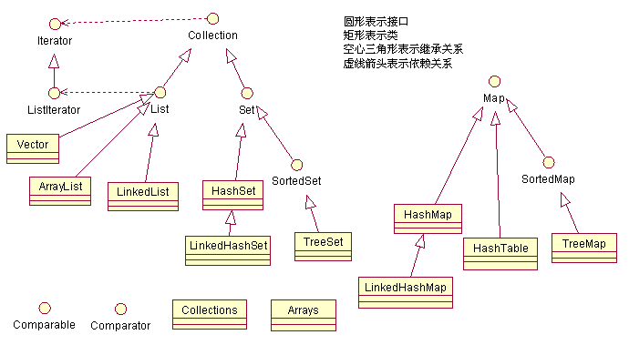
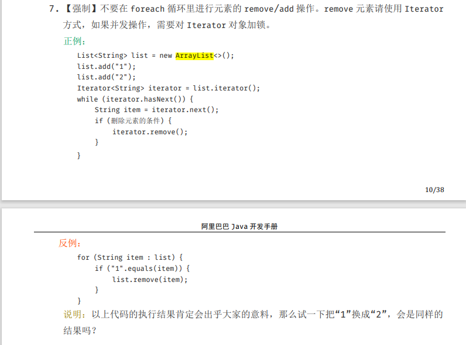

## 2.2 Java集合

> **作者:** 小周吃了吗。
>
> **说明:**  本篇讲述Collection、Map接口下的集合实现类源码说明

### 2.2.1 List,Set,Map三者的区别？

- **List(对付顺序的好帮手)：** List接口存储一组不唯一（可以有多个元素引用相同的对象），有序的对象
- **Set(注重独一无二的性质):** 不允许重复的集合。不会有多个元素引用相同的对象。
- **Map(用Key来搜索的专家):** 使用键值对存储。Map会维护与Key有关联的值。两个Key可以引用相同的对象，但Key不能重复，典型的Key是String类型，但也可以是任何对象。

### 2.2.2 结构图



## 2.3 ArrayList 源码解析

- **属性说明:**  知道属性代表含义提高对源码理解

```java
public class ArrayList<E> extends AbstractList<E>
        implements List<E>, RandomAccess, Cloneable, java.io.Serializable
{   
    //序列码
    private static final long serialVersionUID = 8683452581122892189L;

    /**
     * 默认初始化大小
     */
    private static final int DEFAULT_CAPACITY = 10;

    /**
     * 用于空实例的共享空数组实例。
     */
    private static final Object[] EMPTY_ELEMENTDATA = {};

    /**
     * 用于默认大小的空实例的共享空数组实例。
     * 我们将其与EMPTY_ELEMENTDATA区分开来，以便知道何时膨胀多少添加第一个元素。
     * 当用户指定 ArrayList 容量为 0 时，返回该空数组
     */
    private static final Object[] DEFAULTCAPACITY_EMPTY_ELEMENTDATA = {};

    /**
     * 存储ArrayList元素的数组缓冲区。
     * ArrayList的容量是这个数组缓冲区的长度。 
     * 
     * 被标记为transient，在对象被序列化的时候不会被序列化。
     */
    transient Object[] elementData; // non-private to simplify nested class access

    /**
     * ArrayList的大小(包含的元素数量)。
     *
     * @serial
     */
    private int size;

    /**
    * 分派给arrays的最大容量
    * 为什么要减去8呢？
    * 因为某些VM会在数组中保留一些头字，尝试分配这个最大存储容量，可能会导致array容量大于VM的limit，最终导致OutOfMemoryError。
    */
    private static final int MAX_ARRAY_SIZE = Integer.MAX_VALUE - 8;

    /**
    * 修改次数
    */
    protected transient int modCount = 0;

    /**
     * 创建一个具有指定初始容量的空列表。
     * @param  initialCapacity  列表的初始容量
     * @throws IllegalArgumentException if the specified initial capacity
     *         is negative
     */
    public ArrayList(int initialCapacity) {
        // 如果初始值>0,创建一个 `initialCapacity`大小的数组赋值给 elementData
        if (initialCapacity > 0) { 
            this.elementData = new Object[initialCapacity];
        } else if (initialCapacity == 0) {
            //如果初始值 = 0, 将EMPTY_ELEMENTDATA 赋值给 elementData
            this.elementData = EMPTY_ELEMENTDATA;
        } else {
            // 初始值 < 0 抛出异常
            throw new IllegalArgumentException("Illegal Capacity: "+
                                               initialCapacity);
        }
    }

    /**
     * 构造一个初始容量为10的空列表。 这里赋值后 elementData 还是为空，初始化将在`add()`方法中
     */
    public ArrayList() {
        this.elementData = DEFAULTCAPACITY_EMPTY_ELEMENTDATA;
    }

    /**
     * 构造包含指定元素的列表
     * 集合，按照集合返回的顺序
     * 迭代器。
     *
     * @param c 放入列表中的集合
     * @throws NullPointerException 如果指定的集合为空 抛出异常
     */
    public ArrayList(Collection<? extends E> c) {
        //将传入的集合转化成Object[]的数组
        elementData = c.toArray();
        //如果 将elementData长度赋值给`size`,并判断是否等于0
        if ((size = elementData.length) != 0) {
            // c.toArray 可能不会返回 Object[]，可以查看 java 官方编号为 6260652 的 bug
            if (elementData.getClass() != Object[].class)
                //如果  c.toArray 返回不是 Object[],就是使用 Arrays.copyOf() 创建一个大小为size的Object[]数组。
                elementData = Arrays.copyOf(elementData, size, Object[].class);
        } else {
            // 替换为空数组。
            this.elementData = EMPTY_ELEMENTDATA;
        }
    }
}
```

### 2.3.1 ArrayList 扩容机制
- **说明:** ArrayList 扩容机制是嵌套在`add()`方法中的

#### add() 方法
```java
    /**
     * 将指定的元素追加到列表的末尾。
     *
     * @param e 要追加到集合中的元素
     * @return <tt>true</tt> (as specified by {@link Collection#add})
     */
    public boolean add(E e) {
        //判断是否需要扩容（重点）
        ensureCapacityInternal(size + 1);  // Increments modCount!!
        //新增很简单，就是往数组末尾赋值就ok了
        elementData[size++] = e;
        return true;
    }
```
> **注意:**  JDK11 移除了 `ensureCapacityInternal()` 和 `ensureExplicitCapacity()` 方法

#### ensureCapacityInternal() 方法
```java
    private void ensureCapacityInternal(int minCapacity) {
        // 如果是第一次扩容
        if (elementData == DEFAULTCAPACITY_EMPTY_ELEMENTDATA) {
            // 使用Math.max 函数获取最大的值, 一般 minCapacity > DEFAULT_CAPACITY
            minCapacity = Math.max(DEFAULT_CAPACITY, minCapacity);
        }
        //调用 ensureExplicitCapacity 方法
        ensureExplicitCapacity(minCapacity);
    }
```

#### ensureExplicitCapacity() 方法
```java
    private void ensureExplicitCapacity(int minCapacity) {
        //修改次数 +1
        modCount++;

        // 判断 当前需要扩容的大小是否 大于 当前集合大小长度 
        if (minCapacity - elementData.length > 0)
            //真正意义的去调用扩容方法
            grow(minCapacity);
    }
```

#### grow() 方法 
```java
    /**
     * 增加容量，以确保它能容纳至少
     * 由最小容量参数指定的元素数量。
     *
     * @param minCapacity 所需的最小容量
     */
    private void grow(int minCapacity) {
        // 将扩容前的集合（老集合）大小赋值给 `oldCapacity`
        int oldCapacity = elementData.length;
        // 重点 重点 重点 ，为什么说ArrayList扩容倍数是1.5
        // 因为 老集合长度 + 老集合长度向右移动一位,也就是 oldCapacity/2
        // 所以 ArrayList扩容增加原集合大小的1.5倍
        int newCapacity = oldCapacity + (oldCapacity >> 1);
        //判断 新扩容大小 如果小于 最小扩容大小，就将 minCapacity 赋值给 newCapacity，这个没啥意义
        if (newCapacity - minCapacity < 0)
            newCapacity = minCapacity;
        //判断如果 新扩容大小 大于 MAX_ARRAY_SIZE ，调用 `hugeCapacity()` 方法
        if (newCapacity - MAX_ARRAY_SIZE > 0)
            newCapacity = hugeCapacity(minCapacity);
        // 将老集合克隆成一个大小为 为 newCapacity 的新集合，并赋值给 elementData
        elementData = Arrays.copyOf(elementData, newCapacity);
    }

    private static int hugeCapacity(int minCapacity) {
        //判断 最小扩容大小 是否大于0，否则抛出异常
        if (minCapacity < 0) // overflow
            throw new OutOfMemoryError();
        // 如果最小单位大于 MAX_ARRAY_SIZE（MAX_ARRAY_SIZE = Integer.MAX_VALUE - 8 = 2147483647 = 8）返回 Integer.MAX_VALUE , 否则返回 MAX_ARRAY_SIZE
        return (minCapacity > MAX_ARRAY_SIZE) ?
            Integer.MAX_VALUE :
            MAX_ARRAY_SIZE;
    }
```

### 2.3.2 为什么不能再foreach循环里对元素进行remove/add操作

**阿里巴巴开发手册明确规范**



#### 案例

```java
//正例
    List<String> list = new ArrayList<>();
    list.add("1");
    list.add("2");
    
    Iterator<String> iterator = list.iterator();
    while (iterator.hasNext()) {
        String item = iterator.next();
        if ("2".equals(item)) {
            iterator.remove();
        }
    }

//反例 反例 反例

1    List<String> list = new ArrayList<>();
2    list.add("1");
3    list.add("2");
4     
5    for (String item : list) {
6        if ("2".equals(item)) {
7            list.remove(item);
8        }
9    }
```
运行反例代码会抛出`ConcurrentModificationException`异常，如果将第6行改成`"1".equals(item)`则运行成功,欸!这是怎么回事呢,我们来一起探究一下。

#### 反编译

我们都知道foreach是一个语法塘,我们反编译看看,结果如下
```java
public class com.shsr.zhangpuback.utils.test.Test {
  public com.shsr.zhangpuback.utils.test.Test();
    Code:
       0: aload_0
       1: invokespecial #1                  // Method java/lang/Object."<init>":()V
       4: return

  public static void main(java.lang.String[]);
    Code:
       0: new           #2                  // class java/util/ArrayList
       3: dup
       4: invokespecial #3                  // Method java/util/ArrayList."<init>":()V
       7: astore_1
       8: aload_1
       9: ldc           #4                  // String 1
      11: invokeinterface #5,  2            // InterfaceMethod java/util/List.add:(Ljava/lang/Object;)Z
      16: pop
      17: aload_1
      18: ldc           #6                  // String 2
      20: invokeinterface #5,  2            // InterfaceMethod java/util/List.add:(Ljava/lang/Object;)Z
      25: pop
      26: aload_1
      27: invokeinterface #7,  1            // InterfaceMethod java/util/List.iterator:()Ljava/util/Iterator;
      32: astore_2
      33: aload_2
      34: invokeinterface #8,  1            // InterfaceMethod java/util/Iterator.hasNext:()Z
      39: ifeq          72
      42: aload_2
      43: invokeinterface #9,  1            // InterfaceMethod java/util/Iterator.next:()Ljava/lang/Object;
      48: checkcast     #10                 // class java/lang/String
      51: astore_3
      52: ldc           #6                  // String 2
      54: aload_3
      55: invokevirtual #11                 // Method java/lang/String.equals:(Ljava/lang/Object;)Z
      58: ifeq          69
      61: aload_1
      62: aload_3
      63: invokeinterface #12,  2           // InterfaceMethod java/util/List.remove:(Ljava/lang/Object;)Z
      68: pop
      69: goto          33
      72: return
}
```

看不懂没关系,我们看27、34、43行后面的注释,他通过`List.iterator`获取到迭代器,通过`next`判断是否有下一个元素,使用`hasNext`获取下个元素，实现遍历操作。
**注意:** 普通for循环不是这样操作，也就是说普通for循环不会出现这种问题

来看下ArrayList中的iterator()方法
```java
    public Iterator<E> iterator() {
        return new Itr();
    }
```
看一下`Itr`内部类
```java
    private class Itr implements Iterator<E> {
1        int cursor;       // index of next element to return
2        int lastRet = -1; // index of last element returned; -1 if no such
         //将 modCount 赋值给 expectedModCount
3        int expectedModCount = modCount;

4        public boolean hasNext() {
5            return cursor != size;
6        }

7        @SuppressWarnings("unchecked")
8        public E next() {
9            checkForComodification();
10            int i = cursor;
11            if (i >= size)
12                throw new NoSuchElementException();
13            Object[] elementData = ArrayList.this.elementData;
14            if (i >= elementData.length)
15                throw new ConcurrentModificationException();
16            cursor = i + 1;
17            return (E) elementData[lastRet = i];
18        }
        //...
    }
```
`cursor`:下一个元素下标 `lastRet`:最后一位元素下标，如果没有则返回-1

我们可以看到`ConcurrentModificationException`异常是从第九行`checkForComodification()`方法中抛出来的
```java
    final void checkForComodification() {
        if (modCount != expectedModCount)
            throw new ConcurrentModificationException();
    }
```
可以看到modCount与expectedModCount如果不相等就会抛出异常,可以看到ArrayList的add()或者remove()方法,每次对ArrayList做过修改操作，会对modCount修改标志位做出+1的操作。
这里modCount作为一个快速失败的作用。**什么是快速失败？在并发场景下,迭代器会快速抛出异常,而不是在任意时间点冒着不确定的风险来进行操作，也就是将可能出现的bug前推**。
在这里,如果其他线程对该集合做出了修改cursor+1,调用next方法时将快速抛出异常。

我们可以用上面反例来举一个例子


### 补充内容:
- **RandomAccess接口**
```java
    public interface RandomAccess {
    }
```
查看源码我们发现实际上 `RandomAccess` 接口中什么都没有定义。所以，在我看来 `RandomAccess` 接口不过是一个标识罢了。标识什么？ 标识实现这个接口的类具有随机访问功能。

**下面再总结一下 list 的遍历方式选择：**

- 实现了 `RandomAccess` 接口的list，优先选择普通 for 循环 ，其次 foreach,
- 未实现 `RandomAccess`接口的list，优先选择iterator遍历（foreach遍历底层也是通过iterator实现的,），大size的数据，千万不要使用普通for循环


#### 未完待续...