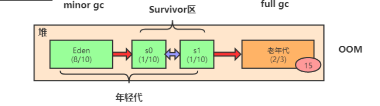

## 2.4 JVM内存模型

> 作者：小周吃了吗。
>
> **介绍:** 此篇幅将简述JVM底层结构以及调优知识

java与C++之间有一堵由内存动态分配和垃圾收集技术所围成的"高墙"，墙外的人想进去，墙里边的人想出来。
### 2.4.1 概述

对于从事C++程序开发的开发人员来说，内存管理领域，他们既是拥有最高权力的皇帝，又是从事最基础的劳动人民--既拥有对象的所有权，又担负着每一个对象生命从开始到终结的维护责任。

对于java程序来说，在虚拟机自动管理内存机制下，不需要为每一个对象去编写delete/free代码，不容易出现内存泄露和内存溢出的问题，正因为如此，将权力交给虚拟机，一旦出现内存泄露和内存溢出的问题，如果不了解虚拟机，这将是非常麻烦的一件事情。本编 将对虚拟机展开由浅层次到深入的探索

### 运行时数据区域
java虚拟机将内存划分了不同区域，每个区域对应不同的用途

**JDK1.8：**

#### 程序计数器

程序计数器是一块较小的内存空间，可以看作是当前线程所执行的字节码的行号指示器。**字节码解释器工作时通过改变这个计数器的值来选取下一条需要执行的字节码指令，分支、循环、跳转、异常处理、线程恢复等功能都需要依赖这个计数器来完。**

另外，**为了线程切换后能恢复到正确的执行位置，每条线程都需要有一个独立的程序计数器，各线程之间计数器互不影响，独立存储，我们称这类内存区域为“线程私有”的内存。**

**从上面的介绍中我们知道程序计数器主要有两个作用：**

1. 字节码解释器通过改变程序计数器来依次读取指令，从而实现代码的流程控制，如：顺序执行、选择、循环、异常处理。
2. 在多线程的情况下，程序计数器用于记录当前线程执行的位置，从而当线程被切换回来的时候能够知道该线程上次运行到哪儿了。

**注意：程序计数器是唯一一个不会出现 OutOfMemoryError 的内存区域，它的生命周期随着线程的创建而创建，随着线程的结束而死亡。**

#### Java 虚拟机栈

**与程序计数器一样，Java虚拟机栈也是线程私有的，它的生命周期和线程相同，每开启一个线程就会分配一个栈空间，而每调用一个方法则会分配一个栈帧，用于存储局部变量表、操作数栈、动态链接、方法出口等信息。**

- **局部变量表：** 顾名思义，存储每个方法的局部变量；
- **操作数栈：** 例如：代码有`a=1;b=2;c=a+b`，代码从上往下运行，**虚拟机会将常量1压入操作数栈中，然后赋值给变量a，变量b也是如此，在将常量1、2压入操作数栈计算得3，将3压入操作数栈，最后赋值给变量c；** 具体详情这里不再深入（详情见：***）
- **动态链接：** 在程序运行中，把符号引用转换成直接引用。例如：在线程中调用`a（）`方法，此时在字节码文件中他只是一个符号，当线程运行时将符号转成直接引用，也就是将a方法转换成相对应的代码。
- **方法出口：** 记录方法返回时的具体信息，方法结束时，子方法该返回哪个主方法哪行代码位置，返回什么样的信息，都由方法出口记录着

**Java 内存可以粗糙的区分为堆内存（Heap）和栈内存(Stack),其中栈就是现在说的虚拟机栈，或者说是虚拟机栈中局部变量表部分。** （实际上，Java虚拟机栈是由一个个栈帧组成，而每个栈帧中都拥有：局部变量表、操作数栈、动态链接、方法出口信息。）

**局部变量表主要存放了编译器可知的各种数据类型**（boolean、byte、char、short、int、float、long、double）、**对象引用**（reference类型，它不同于对象本身，可能是一个指向对象起始地址的引用指针，也可能是指向一个代表对象的句柄或其他与此对象相关的位置）。

**Java 虚拟机栈会出现两种异常：StackOverFlowError 和 OutOfMemoryError。**

- **StackOverFlowError：** 若Java虚拟机栈的内存大小不允许动态扩展，那么当线程请求栈的深度超过当前Java虚拟机栈的最大深度的时候，就抛出StackOverFlowError异常。
- **OutOfMemoryError：** 若 Java 虚拟机栈的内存大小允许动态扩展，且当线程请求栈时内存用完了，无法再动态扩展了，此时抛出OutOfMemoryError异常。

Java 虚拟机栈也是线程私有的，每个线程都有各自的Java虚拟机栈，而且随着线程的创建而创建，随着线程的死亡而死亡。

#### 本地方法栈

和虚拟机栈所发挥的作用非常相似，**他们之间区别不过只是虚拟机本地栈运行自己编写的java代码，而本地方法栈则是运行虚拟机中Native(其他语言，例C++)方法**
#### 堆

Java 虚拟机所管理的内存中最大的一块，Java 堆是所有线程共享的一块内存区域，在虚拟机启动时创建。**此内存区域的唯一目的就是存放对象实例，几乎所有的对象实例以及数组都在这里分配内存。**

Java 堆是垃圾收集器管理的主要区域，因此也被称作**GC堆（Garbage Collected Heap）**.从垃圾回收的角度，由于现在收集器基本都采用分代垃圾收集算法，所以Java堆还可以细分为：新生代和老年代：再细致一点有：Eden空间、From Survivor、To Survivor空间等。**进一步划分的目的是更好地回收内存，或者更快地分配内存。**

#### 方法区

方法区和java堆一样，是各个线程共享区域，**它用于存储已被虚拟机加载过的类信息，常量和静态变量、即时编译器编译后的代码等数据**。

**和多人更愿意将方法区称为“永久代”，其实他们并不等价，** HotSpot团队将GC分代收集扩展至方法区，或者说使用永久代来实现方法区而已，这样HopSpot的垃圾收集器能针对方法区进行垃圾回收处理，能够省去专门为方法区编写内存管理代码的工作。

## 对象的创建

### 类加载检查
虚拟机遇到一条new指令的时候，首先会检查这个指令的参数是否能在常量池中定位到一个类的符号引用，并且检查这个符号引用代表的类是否已经被加载、解析和初始化过。如果有，那必须执行相对应的类加载过程。（具体可以参考我在CSDN写的 [内加载机制](https://blog.csdn.net/qq_43469718/article/details/106752595)）

### 分配内存
类检查完毕后，接下来虚拟机将为该类分配内存空间对象所需内存的大小在类加载完成后便可完全确定，为对象分配内存空间的任务等同于把一块内存确定大小的内存从java堆中划分出来。

Java分配内存目前有两种方式

- **指针碰撞：**
    如果Java堆中内存是绝对整齐规划的，那么将内存会分为**已使用内存**以及**空闲内存**两部分，中间有一个指针作为两者的区分界限，**Java根据对象大小来决定指针往空闲内存方向偏移多少位的距离**，从而达到分配内存的目的。
- **空闲列表：**
    如果Java堆中内存是凌乱的，那么Java堆会维护一张名位“空闲列表”的一个集合，**记录存着堆中有哪些内空间是空闲的，在分配内存的时候根据对象的大小来选择一块合适的内存空间划分给对象**，从而达到分配内存的目的。
    
Java使用哪种内存分配方式是由内存是否规整来决定的，而内存是否规整则是由垃圾收集器决定的。因此在使用Serial、ParNew等带Compact过程的收集器时，系统采用的是指针碰撞，而是用CMS这种基于
Mark-Sweep算法的收集器时，通常采用空闲列表

分配内存会诱发另一种问题，有多条线程来进行内存分配该怎么办？

**解决内存并发问题的办法：**

- **CAS（compare and swap）**
    虚拟机采用失败重试（CAS）的方式保证更新才做的原子性来对内存进行分配。
- **本地线程分配缓冲区（Tread Local Allocation Buffer,TLAB）**
    这种办法是把内存分配的动作按照线程划分在不同的空间中进行，及每一个线程在Java堆中预先分配一个小块内存，给对象分配内存的时候直接使用预分配的内存即可。

### 初始化
内存分配完毕后，虚拟机需要将分配道德内存空间都初始化零值（不包括对象头），如果使用TLAB，这一工作将提前至TLAB分配时完成。这一步操作保证了对象的实例字段在Java代码中可以不赋初值就可以直接使用
，程序能访问到这些字段的数据类型所对应的零值。

### 设置对象头
初始化完毕后，这个对象是哪个类的实例，如何才能找到类的元信息，对象的哈希码，对象的GC分代年龄等等，这些信息将保存在对象头（Object Header）中。对象头的另外一部分是类型指针，即对象指向它的类元数据的指针，虚拟机通过这个指针来确定这个对象是哪个类的实例。

对象投布局分为三块区域：对象头（Header）、实例数据（Instance Data）和对象填充（Padding）。